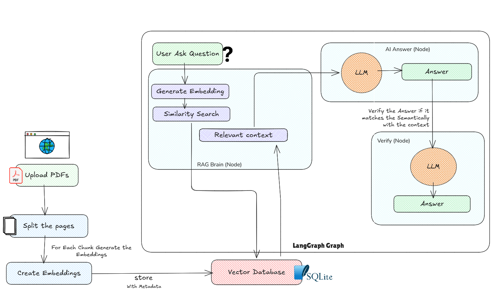

## Project Idea: PDF Upload and Chat Assistant

## Name: DocChatAI

### Description: 
The **PDF Upload & Chat Assistant** is a web-based application built using **_Streamlit_** and _**LangChain**_ that allows users to upload one or more PDF documents and interact with them using natural language queries.
The system uses a **Retrieval-Augmented Generation (RAG)** approach to ensure that responses are generated only from the uploaded document content, reducing hallucinations and improving accuracy.

### Objective: 
In this project, you need to:

- Enable users to upload PDF documents through a web interface
- Process and store document content in a searchable vector database
- Allow users to ask natural language questions about the PDFs
- Retrieve the most relevant document chunks for each query
- Generate accurate, context-aware answers using a language model
- Maintain conversational context across multiple user queries

### Workflow:

1. User uploads one or more PDF files
2. User clicks a process button
3. Documents are loaded, split, and embedded
4. Embeddings are stored in a vector database
5. User asks a question
6. Relevant document chunks are retrieved
7. The language model generates a context-based answer
8. Conversation history is updated and displayed

## Technology Stack:
1. Python 3.12
2. Langchain 
3. Langgraph
4. SQlite Vector Database
5. Embeddings
6. Google Gemini
7. StreamLit

## Architecture:
